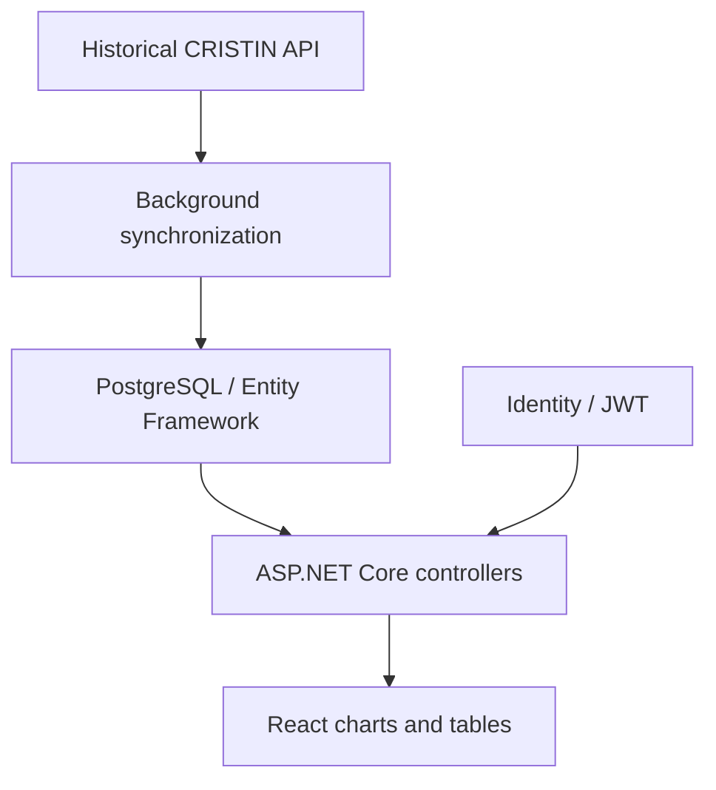

# UiA Research Dashboard

A University of Agder bachelor project for exploring research publications, research groups and collaborations across faculties and institutes. The application combines a **React interface**, an **ASP.NET Core API**, **PostgreSQL**, and background synchronization of **CRISTIN** research information.

**DAT304 · Group 9 · University of Agder · 2021**

[Read the thesis](docs/reports/bachelor-thesis-2021.pdf) · [Restore the original demo](docs/large-artifacts.md) · [Restore the presentation](docs/large-artifacts.md)

## What the project contains

- Publication and research views organized by faculty, institute and research group.
- Charts and tables for exploring publication data and research activity.
- A relational model connecting publications, contributors, institutions and groups.
- Background import, caching and retry logic for the historical CRISTIN API.
- Identity and JWT authentication code for administrative functionality.

## Repository guide

| Location | Contents |
|---|---|
| [src/PBDASHBOARD/](src/PBDASHBOARD) | ASP.NET Core application, migrations, data model and configuration templates |
| [src/PBDASHBOARD/ClientApp/](src/PBDASHBOARD/ClientApp) | React source, public assets and original dependency lockfile |
| [docs/reports/](docs/reports) | Original bachelor thesis |
| [docs/slides/](docs/slides) | Original presentation |
| [docs/appendices/](docs/appendices) | Submitted technical and group appendices |
| [demos/](demos) | Original MP4 demonstration |
| [docs/restoration.md](docs/restoration.md) | Setup notes, configuration changes and validation limits |

## Architecture



## Restore the original media

The 18 MB demo and 22 MB presentation are preserved as lossless parts because the available upload interfaces rejected the complete files. After cloning the repository, run:

```sh
python3 scripts/restore_artifacts.py
```

This recreates both original files and checks their SHA-256 hashes. See [the artifact instructions](docs/large-artifacts.md).

## Restore the original media

The 18 MB demo and 22 MB presentation are preserved as lossless parts because the available upload interfaces rejected the complete files. After cloning the repository, run:

```sh
python3 scripts/restore_artifacts.py
```

This recreates both original files and checks their SHA-256 hashes. See [the artifact instructions](docs/large-artifacts.md).

## Running the source

This is an **archived 2021 application**, targeting .NET Core 3.1 and React 16. Its dependencies and remote API assumptions have not been upgraded. The source needs a compatible development environment and restoration work before it can be treated as a working deployment.

Start with [the restoration notes](docs/restoration.md). They describe how to supply database and authentication settings without putting credentials in Git. The original report and demo document the submitted application; they do not prove the cleaned source currently runs end to end.

## Authors

**Filmon Berhe Mebrahtom · Mohamed Ali Abdullahi · Yeronis Assefa Hubena**

Supervisor: **Professor Arne Wiklund**, University of Agder. Original group credits are retained; this repository does not assign individual contributions. No new license is asserted for the original submission or its dependencies.
